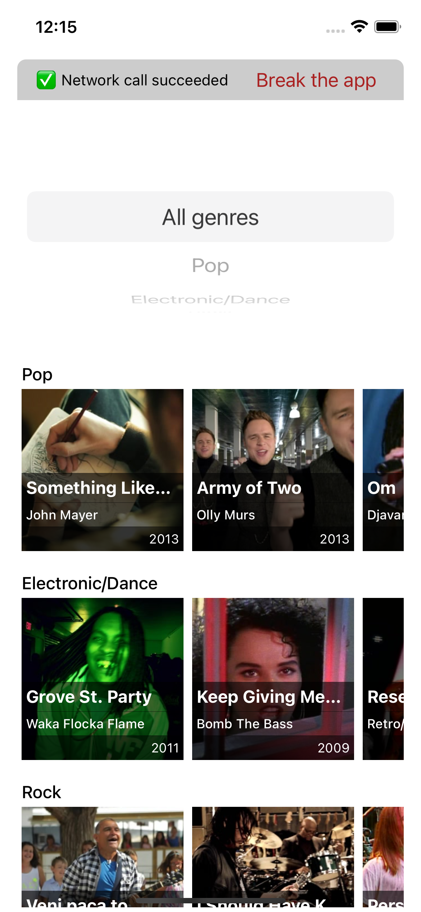
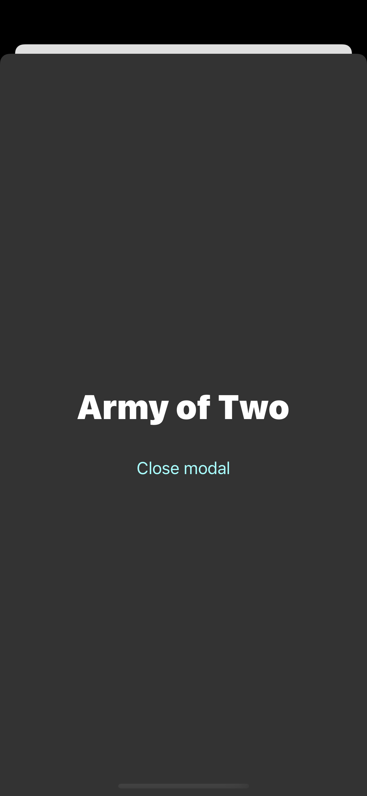
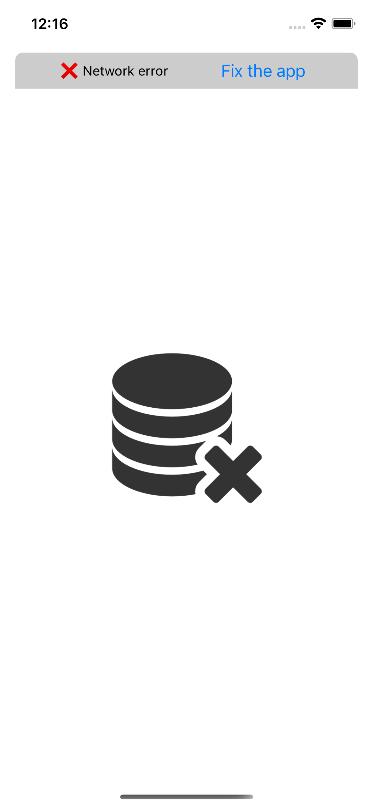
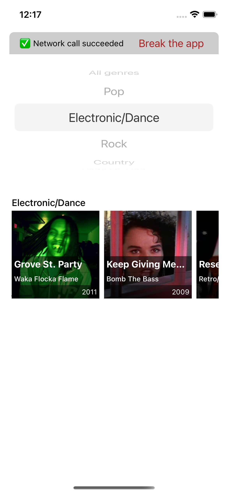

# XITE Assignment - Mobile QA Automation Engineer

## Introduction

This assignment uses JavaScript, [React Native](https://reactnative.dev/) and the [Detox](https://wix.github.io/Detox/) e2e testing framework.

It's a simple example app that fetches some mock videos from an online resource and displays it inside a list.

Detox is already configured in this project.

## Objective

Your task is to write end-to-end tests for this app. You can invent as many test cases as you want - be creative!

Tests are located in the `e2e` folder. Some sample tests are included.

You can pick iOS or Android as your primary platform, we will use it to run your tests. Make sure to let us know which one you picked!

You may need to add `testId`s for elements you want to look up inside your tests. Example: `ActivityIndicator` inside `Loader.js`.

You should commit your code using git. At the end, you can upload your assignment to GitHub or send us a zip file, whichever you prefer.

## App functionality

At the top of the screen, there's a button that can simulate a network error by modifying the datasource URL to one that doesn't work. When this happens, the app displays an error icon and a "fix" button appears that brings it back to the usable state.

The main screen contains a scrollable list of genres. Inside each genre, there's a horizontally scrollable list of videos for that genre.

There's a dropdown that allows you to filter the list of genres.

You can pull to refresh the video list.

When you press a video, a popup will display that contains the title of the video. After 5 seconds, the popup disappears. It can also be closed with a button.

Some genres are empty.

## Running the app

You can run the development version of the app on both iOS and Android using the `yarn ios` and `yarn android` commands.

> Before running the iOS version, you need to run `npx pod-install` once.

## Running detox e2e tests

In order to set up your environment, you might need to go through the [Detox getting started guide](https://wix.github.io/Detox/docs/introduction/getting-started/).

To run the tests, there are 2 commands required:

- `yarn e2eBuildIos` builds the test app
- `yarn e2eTestIos` runs the tests

> _For Android, replace `Ios` with `Android`_.
>
> You will also need to set up an emulator with the name `Pixel_4a_API_30`. Alternatively, you can replace the emulator name inside `.detoxrc.json` with your emulator's name.

The build step only needs to be run once. After that, you can modify your tests and re-run them without rebuilding.

That's it! Good luck and be sure to check out the [Detox docs](https://wix.github.io/Detox/docs/api/matchers).

## Screenshots (iOS)

|         Main screen          |          Modal open          |
| :--------------------------: | :--------------------------: |
|  |  |

|        Network error         |        Filtered list         |
| :--------------------------: | :--------------------------: |
|  |  |
